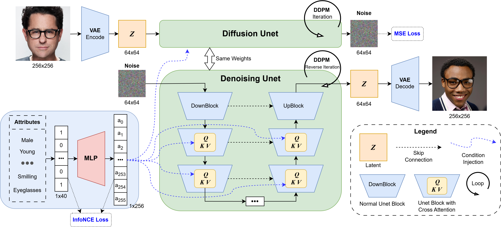

# EEEM068-HumanFaces-Diffusion
*EEEM068 - Coursework - Group 5*

## 1. Project Overview

This repository contains an implementation of diffusion models for image generation, specifically focused on human faces.

<p align="center">
  
</p>

<p align="center">
Overview of our proposed attribute-based diffusion pipeline for human faces generation.
</p>


<p align="center">
  
</p>
<p align="center">
Sample generated human faces through training epochs.
</p>

### Table of Contents

1. [Project Overview](#1-project-overview)
2. [Installation](#2-installation)
   - [2.1 Setup with UV](#21-setup-with-uv)
3. [Project Structure](#3-project-structure)
4. [Usage](#4-usage)
   - [4.1 Training](#41-training)
     - [4.1.1 Training use YAML config (recommended)](#411-training-use-yaml-config-recommended)
     - [4.1.2 Training use script arguments](#412-training-use-script-arguments)
     - [4.1.3 Training with Accelerate (distributed training)](#413-training-with-accelerate-distributed-training)
     - [4.1.4 Using the Notebook (deprecated)](#414-using-the-notebook-old-deprecated-method)
   - [4.2 Image Generation](#42-image-generation)
     - [4.2.1 Generation using the Gradio UI](#421-generation-using-the-gradio-ui)
     - [4.2.2 Generation using the command line script](#422-generation-using-the-command-line-script)
     - [4.2.3 Attribute-Based Generation](#423-attribute-based-generation)
5. [License](#5-license)
6. [Contributors](#6-contributors)

## 2. Installation

### 2.1 Setup with UV

Using UV for dependency management:

```bash
# Install UV
curl -LsSf https://astral.sh/uv/install.sh | sh

# Create a virtual environment and install dependencies
uv venv --python 3.11
# Activate the virtual environment
source .venv/bin/activate

# Install required dependencies
uv pip install -e .

# For development (linting, formatting, etc.)
uv pip install -e .[dev]

# For notebook - quick interactive session
uv pip install -e .[notebook]
```

## 3. Project Structure

```
EEEM068-Diffusion-Models/
├── diffusion_models/           # Main package directory
│   ├── models/                 # Model definitions
│   ├── utils/                  # Utility functions
│   ├── datasets/               # Dataset handling
│   └── visualization/          # Visualization tools
├── scripts/                    # Executable scripts
├── data/                       # Data directory
│   ├── raw/                    # Raw data
│   └── processed/              # Processed data
├── outputs/                    # Output files
│   ├── checkpoints/            # Model checkpoints
│   └── samples/                # Generated samples
├── tests/                      # Test directory
├── docs/                       # Documentation
├── notebooks/                  # Jupyter notebooks
├── main.py                     # Application entry point
└── README.md                   # Project documentation
```

## 4. Usage

### 4.1 Training

#### 4.1.1 Training use YAML config (recommended)

It is recommended to config your experiment with the YAML config file to train the model.
The sample configs for unconditional and conditional training are located at folder `configs/unconditional` and `configs/conditional` respectively.

```bash
python scripts/train.py --config <path_to_config_file>
```

#### 4.1.2 Training use script arguments

To train a model, use the `train.py` script:

```bash
python scripts/train.py \
    --model unet_notebook \
    --run-name "my_experiment" \
    --image-size 128 \
    --train-batch-size 16 \
    --eval-batch-size 16 \
    --num-epochs 100 \
    --learning-rate 1e-4 \
    --weight-decay 1e-2 \
    --lr-warmup-steps 500 \
    --save-image-epochs 5 \
    --save-model-epochs 5 \
    --mixed-precision fp16 \
    --train-dir "data/celeba_hq_256" \
    --val-dir "data/CelebA-HQ-split/test_300" \
    --val-n-samples 100 \
    --num-train-timesteps 1000 \
    --use-wandb True \
    --wandb-project "EEEM068_Diffusion_Models" \
    --wandb-entity "your_username"
```

Key arguments:
- `--model`: Type of model to use (e.g., "unet_notebook", "latent_conditional_unet")
- `--run-name`: Name for the run (used for WandB run name and output directory)
- `--image-size`: Target image resolution
- `--train-batch-size`: Training batch size
- `--eval-batch-size`: Evaluation batch size
- `--num-epochs`: Number of training epochs
- `--learning-rate`: Learning rate for optimizer
- `--weight-decay`: Weight decay for optimizer
- `--lr-warmup-steps`: Number of learning rate warmup steps
- `--save-image-epochs`: Save generated images every N epochs
- `--save-model-epochs`: Save model checkpoint every N epochs
- `--mixed-precision`: Mixed precision training type ("no" or "fp16")
- `--train-dir`: Training data directory
- `--val-dir`: Validation data directory
- `--val-n-samples`: Number of samples to generate for FID calculation
- `--num-train-timesteps`: Number of timesteps for DDPM scheduler
- `--use-wandb`: Whether to use WandB logging
- `--wandb-project`: Name of the WandB project
- `--wandb-entity`: Name of the WandB entity
- **Conditional diffusion parameters**
  - `--is-conditional`: Whether to use conditional generation
  - `--attribute-file`: Path to the attribute labels file
  - `--num-attributes`: Number of attributes in the dataset
  - `--grid-attribute-indices`: List of attribute indices for grid visualization. Check the [All Attributes for **CelebAMask-HQ** Dataset](#all-attributes-for-celebamask-hq-dataset) for the index of each attribute.
  - `--grid-num-samples`: Number of samples in the visualization grid
  - `--grid-sample-random-remaining-indices`: Whether to randomly sample remaining indices for grid visualization

The training script will:
1. Save regular checkpoints every `save_model_epochs` epochs
2. Save the best model (based on FID score) whenever the score improves
3. Generate and save sample images every `save_image_epochs` epochs
4. Log training metrics and generated images to WandB if enabled

The best model will be saved in `{output_dir}/best_model/` while regular checkpoints will be saved in `{output_dir}/`.

<details>
<summary>All Attributes for **CelebAMask-HQ** Dataset</summary>

Link to the dataset: [CelebAMask-HQ](https://github.com/switchablenorms/CelebAMask-HQ)

<p align="center">

| Attribute Index | Attribute Name |
|-----------------|----------------|
| 0 | 5_o_Clock_Shadow |
| 1 | Arched_Eyebrows |
| 2 | Attractive |
| 3 | Bags_Under_Eyes |
| 4 | Bald |
| 5 | Bangs |
| 6 | Big_Lips |
| 7 | Big_Nose |
| 8 | Black_Hair |
| 9 | Blond_Hair |
| 10 | Blurry |
| 11 | Brown_Hair |
| 12 | Bushy_Eyebrows |
| 13 | Chubby |
| 14 | Double_Chin |
| 15 | Eyeglasses |
| 16 | Goatee |
| 17 | Gray_Hair |
| 18 | Heavy_Makeup |
| 19 | High_Cheekbones |
| 20 | Male |
| 21 | Mouth_Slightly_Open |
| 22 | Mustache |
| 23 | Narrow_Eyes |
| 24 | No_Beard |
| 25 | Oval_Face |
| 26 | Pale_Skin |
| 27 | Pointy_Nose |
| 28 | Receding_Hairline |
| 29 | Rosy_Cheeks |
| 30 | Sideburns |
| 31 | Smiling |
| 32 | Straight_Hair |
| 33 | Wavy_Hair |
| 34 | Wearing_Earrings |
| 35 | Wearing_Hat |
| 36 | Wearing_Lipstick |
| 37 | Wearing_Necklace |
| 38 | Wearing_Necktie |
| 39 | Young |

</p>
</details>

#### 4.1.3 Training with Accelerate (distributed training)

The training script uses the Hugging Face 🤗 Accelerate library for distributed training. Follow these steps to train a model:

1. First-time setup: Configure accelerate (one-time setup)
```bash
accelerate config
```

2. Launch training:
```bash
# Training with accelerate
accelerate launch scripts/train.py \
    --train-dir "data/CelebA-HQ-split/train_27000" \
    --val-dir "data/CelebA-HQ-split/test_300" \
    --output-dir "outputs/checkpoints/ddpm-celebahq-128" \
    --image-size 128 \
    --train-batch-size 16 \
    --eval-batch-size 16 \
    --num-epochs 100 \
    --gradient-accumulation-steps 1 \
    --learning-rate 1e-4 \
    --lr-warmup-steps 500 \
    --mixed-precision "fp16" \
    --use-wandb \
    --seed 42
```

### 4.1.4 Using the Notebook (old deprecated method)

Alternatively, you can use the provided Jupyter notebooks for a more interactive experience:

**Note:** This method is only for the default unconditional training experiments. It may not be updated with latest models and code.

```bash
# Start Jupyter Lab
jupyter lab
```

Then navigate to `notebooks/` directory and open the relevant notebook.

### 4.2 Image Generation

You can generate images in two ways:

#### 4.2.1 Generation using the Gradio UI:
```bash
python ui/app.py

# Or using UV for dependency management
uv run ui/app.py
```

The UI provides two tabs:
- Single Image Generation: Generate one image at a time with custom noise input
- Batch Generation: Generate multiple images with specified parameters

#### 4.2.2 Generation using the command line script:

Input arguments:
- `--checkpoint`: Path to the model checkpoint directory
- `--pipeline`: Pipeline type (`ddpm` or `ddim`)
- `--num-inference-steps`: Number of denoising steps (default: 100 for DDIM, 1000 for DDPM)
- `--num-images`: Number of images to generate
- `--output-dir`: Directory to save generated images
- `--batch-size`: Number of images to generate in parallel
- `--device`: Device to use (`cuda` or `cpu`)
- `--seed`: Random seed for reproducibility

```bash
# Basic DDPM generation (slower)
python scripts/generate.py \
    --checkpoint "checkpoints/ddpm-celebahq-128-27000train-20250316_141247" \
    --pipeline ddpm \
    --num-inference-steps 1000 \
    --num-images 300 \
    --output-dir "outputs/samples/ddpm1000_from_27000train" \
    --batch-size 16 \
    --seed 42

# DDIM generation (faster)
python scripts/generate.py \
    --checkpoint "checkpoints/ddpm-celebahq-128-27000train-20250316_141247" \
    --pipeline ddim \
    --num-inference-steps 100 \
    --num-images 300 \
    --output-dir "outputs/samples/ddim_fast_from_27000train" \
    --batch-size 16 \
    --seed 42
```

#### 4.2.3 Attribute-Based Generation:

For conditional models, you can generate images based on attributes from existing images using the `generate_on_attributes.py` script. This is useful for creating controlled variations of faces while preserving attribute characteristics.

Input arguments:
- `--checkpoint`: Path to the conditional model checkpoint directory
- `--input-dir`: Directory containing input images with attributes to use
- `--attribute-file`: Path to the attribute label file
- `--pipeline`: Pipeline type (`ddpm` or `ddim`)
- `--num-inference-steps`: Number of denoising steps
- `--output-dir`: Directory to save generated images
- `--batch-size`: Number of images to generate in parallel
- `--device`: Device to use (`cuda` or `cpu`)
- `--seed`: Random seed for reproducibility
- `--image-size`: Size of generated images (default: 256)

```bash
# Generate images based on attributes from test images
python scripts/generate_on_attributes.py \
    --checkpoint "checkpoints/conditional_model" \
    --input-dir "data/CelebA-HQ-split/test_300" \
    --attribute-file "data/CelebA-HQ-split/CelebAMask-HQ-attribute-anno.txt" \
    --pipeline ddim \
    --num-inference-steps 100 \
    --output-dir "outputs/samples/attribute_generated" \
    --batch-size 4 \
    --seed 42

# Or use the convenience script
./generate_conditional.sh
```

The script will:
1. Load the input images and their attributes
2. Generate new images conditioned on those attributes
3. Save the output images with the same IDs as the input files

This allows for direct comparison between input and generated images that share the same facial attributes.

## 5. License

This project is part of the EEEM068 Diffusion Models coursework at the University of Surrey.
We publish this code under the MIT license for educational purposes.

## 6. Contributors

Group 5 - Project members:
- [Enggen Sherpa​](https://github.com/enggen)
- [Dhruvraj Singh Rawat​](https://github.com/dhruvraj-singh-rawat)
- [Rishikesan Kirupanantha​](https://github.com/rishikesan19)
- [Tin Hoang​](https://github.com/Tin-Hoang)
